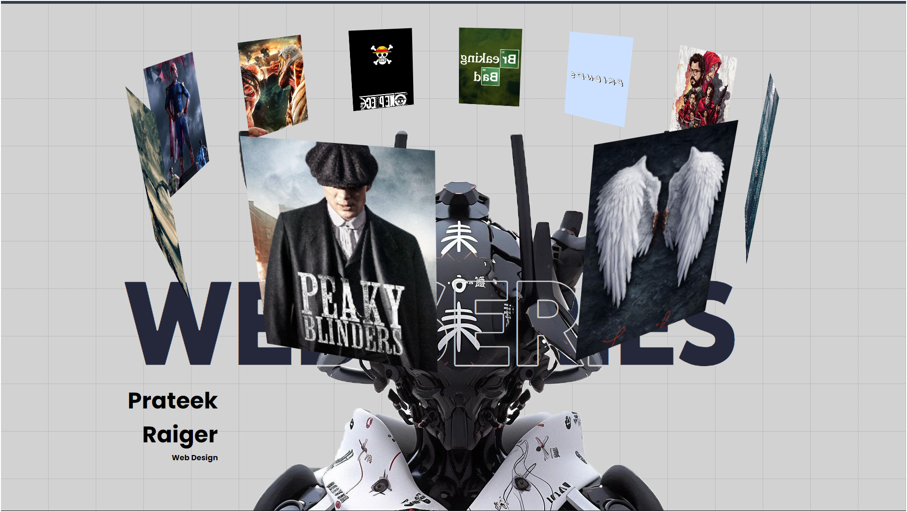

**3D Image Slider: My Favorite Web Series**
=============================================

A 3D image slider showcasing my top 10 favorite web series in a rotating circular motion.

**Features**
------------

* 3D image slider with 10 images of my favorite web series
* Rotating circular motion with smooth transitions
* Responsive design for desktop and mobile devices

**Technologies Used**
--------------------

* HTML5
* CSS3
* CSS 3D Transforms

**How it Works**
----------------

The slider uses CSS 3D transforms to create a rotating circle of images. Each image is positioned at a specific angle around the circle, and the JavaScript code animates the rotation of the circle to create the 3D effect.

**Getting Started**
-------------------

To use this slider, simply clone the repository and open the `index.html` file in your web browser. You can also use the live demo link above to view the slider in action.

**Customization**
---------------

You can customize the slider by modifying the HTML, CSS, and JavaScript files. You can change the images, adjust the rotation speed, and add more features as needed.

**License**
-------

This project is licensed under the MIT License. Feel free to use and modify the code as you like.

**Contributing**
--------------

Pull requests and issues are welcome! If you'd like to contribute to this project, please fork the repository and submit a pull request with your changes.

**Acknowledgments**
------------------
