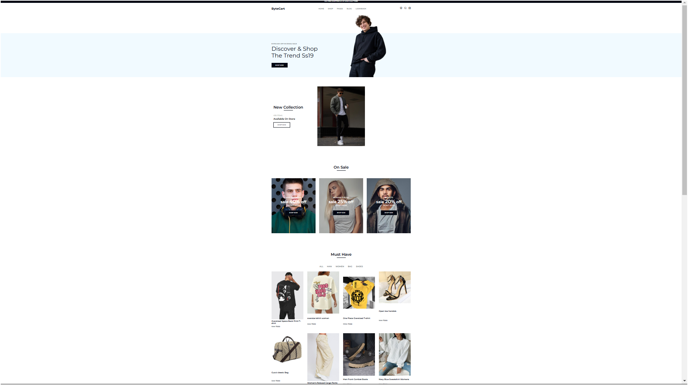

**ByteCard: A Simple E-commerce Website**
=====================================

ByteCard is a basic e-commerce website built using HTML and CSS. This project showcases a simple online store with a collection of images on sale. Here Is The preview of the project

**Features**
------------

* A responsive design that adapts to different screen sizes and devices
* A clean and minimalistic layout that focuses on showcasing the products
* A simple navigation menu that allows users to browse through the products
* A product grid that displays the images with their prices and a "Buy Now" button

**Technologies Used**
--------------------

* HTML5 for structuring the content
* CSS3 for styling and layout

**Getting Started**
-------------------

To run the project locally, follow these steps:

1. Clone the repository to your local machine using `git clone https://github.com/pratik-raiger/byteCard.git`
2. Open the `index.html` file in a web browser to view the website

**File Structure**
-----------------

* `index.html`: The main HTML file that contains the website's content
* `styles.css`: The CSS file that styles the website
* `images`: A folder containing the product images used on the website

**License**
-------

This project is licensed under the MIT License. See the LICENSE file for details.
